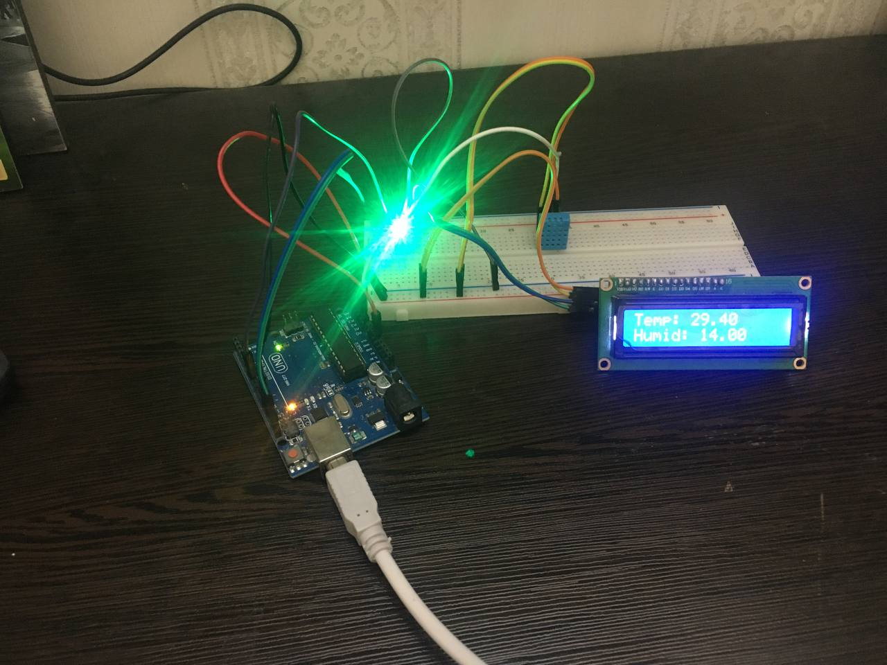

# Summer in LCD

Summer is here and I used some of my sensors and modules in a simple DIY.

In this project we are getting humid and tempereture from a **DHT11** sensor and showing them in a **Liquid Crystal Display**.

I tweeted steps and stuff in [this tweet](https://twitter.com/GNU_Amir/status/1540365414236147714?s=20&t=ch3z2gWIKgDQdmC2hiq3uw). So, **retweet** it!